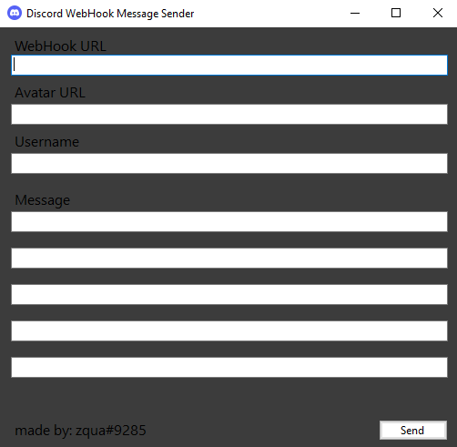

# WebHook-MSG-Sender
This simple app can send a message to a Discord webhook using the discord API.

### Installation
You can download the executable from [here](https://github.com/zquaa/WebHook-MSG-Sender/releases).

### License [MIT](https://github.com/zquaa/WebHook-MSG-Sender/blob/main/LICENSE)

### If you need any support or help you can contact me at my discord: zqua#9285

